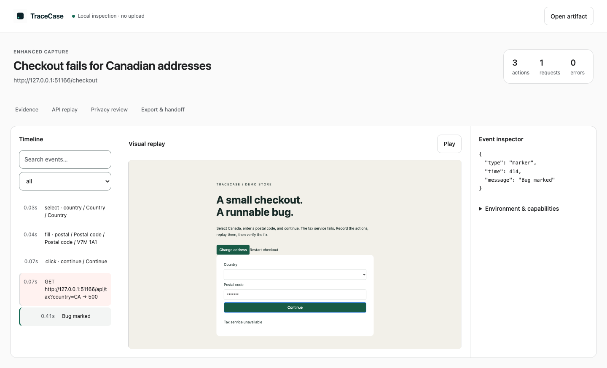
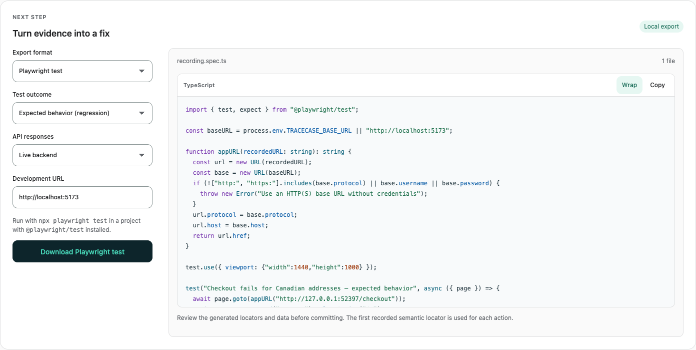

<p align="center">
  
</p>
<h1 align="center">TraceCase</h1>
<p align="center"><strong>Record a bug. Replay the evidence. Verify the fix.</strong></p>
<p align="center">
  <a href="https://github.com/leracherry/tracecase/actions/workflows/ci.yml"></a>
  <a href="LICENSE"></a>
  <a href="docs/RELEASE_NOTES.md"></a>
</p>
<p align="center">
  <a href="#quick-start">Quick start</a> ·
  <a href="docs/WORKFLOWS.md">Visual walkthrough</a> ·
  <a href="docs/README.md">Documentation</a> ·
  <a href="CONTRIBUTING.md">Contributing</a>
</p>

TraceCase turns a browser bug into a portable `.tracecase` recording: actions, visual evidence, console errors, environment details, and optional API responses. Inspect it locally, reproduce it against your development build, then export a Playwright regression test or a concise handoff for a coding agent.

**No account, hosted backend, app SDK, or telemetry is required.** Recording and inspection happen on your device. Executable replay connects to the application you choose.



_The checked-in demo, captured with the actual extension. See the [complete workflow](docs/WORKFLOWS.md)._

> **Experimental alpha:** [`0.1.0-alpha.1` is available on GitHub](https://github.com/leracherry/tracecase/releases/tag/v0.1.0-alpha.1). The source checkout is preparing `0.1.0-alpha.2`; CI produces release bundles. Browser capture supports Chromium. Executable replay is tested in Chromium, Firefox, and WebKit. See [compatibility and limits](docs/BROWSER_COMPATIBILITY.md).

## What you can do

| Workflow                    | Result                                                                                                   |
| --------------------------- | -------------------------------------------------------------------------------------------------------- |
| **Record and inspect**      | Semantic actions, a searchable timeline, visual replay, console errors, and request details in one file. |
| **Reproduce and verify**    | Separate checks for the observed failure and the expected behavior after a fix.                          |
| **Replay captured APIs**    | Reproduce historical responses against a running frontend, with explicit mismatch reporting.             |
| **Create regression tests** | Readable Playwright TypeScript, with optional standalone API fixtures.                                   |
| **Hand off evidence**       | Markdown issue drafts, bounded agent context, read-only MCP tools, and a CI verification action.         |
| **Control capture privacy** | Built-in redaction, custom sensitive fields and private elements, and a review before export.            |

## Quick start

Requires **Node.js 22.12+**, npm, Git, and a Chromium browser for extension capture. Repository access is required to clone it.

```sh
git clone https://github.com/leracherry/tracecase.git
cd tracecase
npm ci
npx playwright install chromium
npm run build
```

Start the demo in one terminal:

```sh
npm run demo
```

In a second terminal, reproduce the checked-in example:

```sh
npm run tracecase -- run examples/checkout.tracecase --url http://127.0.0.1:5173
# FAILURE REPRODUCED
```

That successful reproduction confirms the bug exists. To verify the fix, stop the demo with **Ctrl+C**, restart it in fixed mode, then run the expected-outcome check:

```sh
# Terminal 1 — macOS/Linux
TRACECASE_DEMO_FIXED=1 npm run demo
```

```sh
# Terminal 2
npm run tracecase -- verify examples/checkout.tracecase --url http://127.0.0.1:5173
# VERIFIED
```

For PowerShell, use `$env:TRACECASE_DEMO_FIXED="1"; npm run demo`. See the [getting-started guide](docs/GETTING_STARTED.md) for extension installation, your first capture, and package installation.

## Capture your own bug

1. Open `chrome://extensions`, enable **Developer mode**, and load `apps/extension/.output/chrome-mv3` with **Load unpacked**. Reload your target tab.
2. Open TraceCase. Configure **Privacy settings** if needed, then click **Start recording**. Enhanced API capture and screenshots are optional.
3. Reproduce the issue, **Mark bug**, and **Stop**. The review page opens locally.
4. Inspect the evidence, enter the observed and expected text, choose export categories, and complete the privacy review.
5. Export the recording, or use **Export & handoff** to download a test, issue draft, or agent context.

Starting a new recording replaces the extension’s last temporary capture. Exported files remain yours. [Follow the screenshot walkthrough →](docs/WORKFLOWS.md)

## Turn evidence into a regression test



```sh
npm run tracecase -- test recording.tracecase --out tests/checkout.spec.ts --url http://localhost:5173
```

Generated tests assert **expected behavior by default** and run with `@playwright/test`. Use `--assertion observed` for a reproduction check, or `--network recorded` for a standalone fixture bundle. [Test export guide →](docs/TEST_EXPORT.md)

## Find your next step

| I want to…                                    | Read                                                                                 |
| --------------------------------------------- | ------------------------------------------------------------------------------------ |
| Install, record, and replay my first bug      | [Getting started](docs/GETTING_STARTED.md)                                           |
| See the workflow before trying it             | [Visual walkthrough](docs/WORKFLOWS.md)                                              |
| Find a command or understand a failure        | [CLI reference](docs/CLI.md) · [Troubleshooting](docs/TROUBLESHOOTING.md)            |
| Replay captured responses or repair a locator | [Recorded API replay](docs/NETWORK_REPLAY.md) · [Replay diagnostics](docs/REPLAY.md) |
| Configure privacy for my project              | [Redaction and custom rules](docs/REDACTION.md)                                      |
| Connect an agent or CI job                    | [Agent, MCP, and CI workflows](docs/AGENT_WORKFLOWS.md)                              |
| Build an integration                          | [Plugin API](docs/PLUGINS.md) · [Artifact specification](docs/spec/0.2.md)           |
| Contribute or prepare a release               | [Contributing](CONTRIBUTING.md) · [Release guide](docs/RELEASING.md)                 |

## Scope and privacy

Capture supports top-frame HTTP(S) pages, common semantic controls, SPA history changes, and document navigation. Enhanced mode captures fetch/XHR metadata and bounded JSON/form bodies. Frames, shadow-DOM action targeting, WebSockets, binary bodies, and imported authentication state are not supported. Visual replay blocks remote assets, so appearance can differ from the original page.

Redaction runs before storage, but arbitrary text can still contain sensitive data. Review recordings before sharing. Use disposable local or staging environments: replay performs real actions, and live requests can change application state. Read the [security policy](SECURITY.md), [permissions](docs/PERMISSIONS.md), and [supported browser matrix](docs/BROWSER_COMPATIBILITY.md).

## Development and project status

```sh
npm run check
npm test
```

CI checks Node 22/24, browser capture, privacy boundaries, generated tests, MCP, and replay in Chromium/Firefox/WebKit. It also builds release archives and installs the CLI package into a clean project. See [development setup](CONTRIBUTING.md) and [architecture](docs/ARCHITECTURE.md).

Source builds are available now. Public registry/store publication and Firefox/Safari capture remain future work. Follow the [roadmap](docs/ROADMAP.md), [changelog](CHANGELOG.md), and [release notes](docs/RELEASE_NOTES.md).

Licensed under [MIT](LICENSE). The supplied teal-and-mint identity is documented in the [brand guide](docs/BRAND.md).
