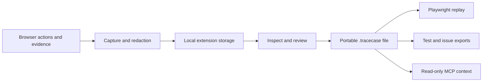

# Architecture

[Documentation home](README.md) · [Contributing](../CONTRIBUTING.md) · [Artifact specification](spec/0.2.md)

TraceCase has three user-facing surfaces: a Chromium extension, a local evidence viewer, and a CLI. They share schema validation, redaction, artifact packaging, and design tokens.

## Evidence flow

The extension stores a single temporary capture locally. Custom privacy settings are snapshotted at recording start and applied before persistence. Reviewed exports are versioned, bounded ZIP artifacts; legacy JSON remains readable. The viewer treats all evidence as untrusted and prevents recorded scripts or remote resources from executing.

Executable replay launches a fresh Playwright browser against a running app. Live mode uses the app’s backend. Recorded mode intercepts supported API traffic and reports coverage; frontend assets still load from the app. Explicit local plugins can transform artifacts or customize the replay context.

## Repository map

| Location                                | Responsibility                                                                                                |
| --------------------------------------- | ------------------------------------------------------------------------------------------------------------- |
| `apps/extension`                        | Popup, privacy settings, recording overlay, background persistence, enhanced capture, and review entry point. |
| `apps/viewer`                           | Timeline, sanitized rrweb replay, network coverage, privacy review, and export workbench.                     |
| `packages/schema`                       | Runtime validators and artifact types.                                                                        |
| `packages/artifact`                     | Bounded ZIP reading/writing, integrity checks, and legacy format support.                                     |
| `packages/capture`                      | Extension semantic actions and navigation capture.                                                            |
| `packages/recorder`                     | Original interactive Playwright recorder.                                                                     |
| `packages/redaction`                    | Built-in and configurable redaction and privacy-rule validation.                                              |
| `packages/network-fixtures`             | API fixture eligibility, matching, routing, and coverage.                                                     |
| `packages/replay`                       | Action execution, outcome checks, reports, and explicit locator repair.                                       |
| `packages/playwright-export`            | Standalone test generation and bundled fixture helper.                                                        |
| `packages/context`, `packages/mcp`      | Bounded handoffs and read-only MCP access.                                                                    |
| `packages/plugins`                      | Explicit trusted transform and replay hooks.                                                                  |
| `packages/cli`                          | User commands, local viewer server, and output handling.                                                      |
| `packages/ui`                           | Shared brand, color, type, and control tokens.                                                                |
| `fixtures`, `examples`, `tests`         | Synthetic apps, example recordings, and automated verification.                                               |
| `scripts/releases`, `.github/workflows` | Package assembly, clean-install checks, and draft-release automation.                                         |
| `scripts/docs`                          | Reproducible workflow screenshots and documentation link checks.                                              |

## Contracts worth preserving

- Redact before persistence, not only before export.
- Validate artifacts at trust boundaries; never execute plugin instructions from a recording.
- Keep reproduction and fix verification distinct.
- Do not silently retry actions that may have side effects.
- Require an explicit choice for locator repair and preserve the source recording.
- Keep fixture exports standalone; build their helper with `npm run build:export` rather than editing generated source.

The core workflow requires no accounts, hosted storage, analytics, or AI service. See [security](../SECURITY.md), [permissions](PERMISSIONS.md), and [format limits](spec/0.2.md) for the boundaries of that design.
