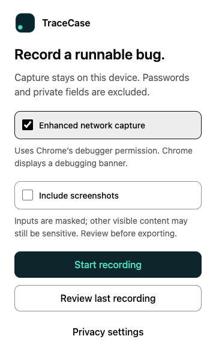
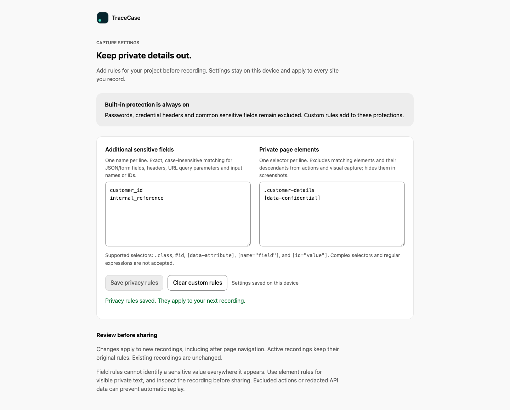
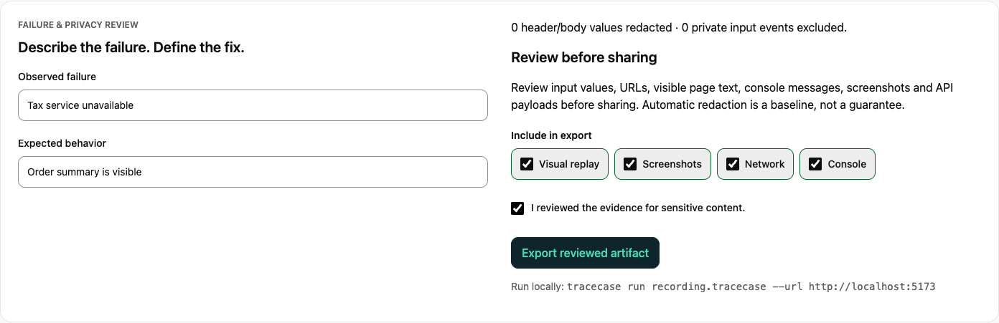

# A recording, from capture to regression test

[Documentation home](README.md) · [Try it yourself](GETTING_STARTED.md)

These screenshots show the actual TraceCase interface using the repository’s synthetic checkout demo. The recording title is set to describe the scenario; all captured actions and evidence come from the extension.

## 1. Choose what to capture

Start with standard capture, or enable enhanced capture for API evidence. Screenshots are optional. The popup also opens the most recent recording and privacy settings.



## 2. Keep project-specific details private

Add sensitive field names and simple selectors before recording. Rules extend the built-in protections and are saved locally. Each recording keeps its original rules through navigation.



[Rule syntax and limitations →](REDACTION.md#custom-browser-privacy-rules)

## 3. Inspect the failure in context

Select **Canada**, enter a postal code, and continue in the demo. After the tax request fails, mark the bug and stop recording. The inspector brings the timeline, visual evidence, and event details together.


Timeline selection seeks visual replay. Toggle **Actual size** to read details at the recorded scale, then toggle it off to fit the pane. Search and filters help narrow the evidence; **API replay** accepts a replay report to show actual request coverage.

## 4. Define the fix and review the evidence

Set the observed and expected visible text. Exclude categories you do not want to share, review the remaining evidence, and export the recording.



The same edits and exclusions feed developer exports. Your source file is not overwritten.

## 5. Export a test or a handoff

Use **Export & handoff** to preview a Playwright test, Markdown issue draft, or bounded agent context. Tests check expected behavior by default. Recorded responses create a downloadable bundle containing the test and its fixtures.


[Test export →](TEST_EXPORT.md) · [Issue drafts, MCP, and CI →](AGENT_WORKFLOWS.md)

## Refresh these screenshots

The capture script builds no mock UI and uses a temporary browser profile with synthetic data. It pregrants debugger permission in a temporary extension copy for automation; the shipped extension requests it interactively.

```sh
npm run build
npx playwright install chromium
node scripts/docs/screenshots.mjs
```

Generated PNGs live in `docs/assets/screenshots`. Review them visually before committing, especially after changes to UI labels or layout. PNG screenshots keep the documentation readable without autoplay or a large animated download.
